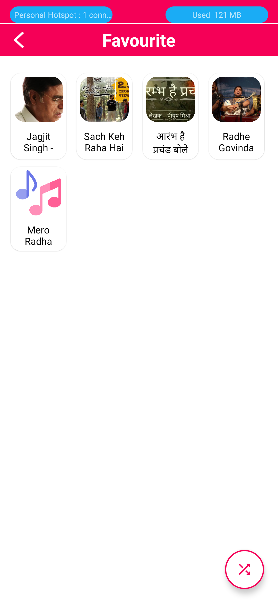

# MusicPlayer App

MyMusicPlayer is a feature-rich music player application that allows you to enjoy your favorite music with ease. With a user-friendly interface and a range of useful features such as notifications, playlist management, favorites, and Bluetooth control, this app is designed to enhance your music listening experience. Whether you're a casual listener or a music enthusiast, MyMusicPlayer has something for everyone.

## Screenshots

   
   
   

   

   
   

## Features

### 1. Notification Control
Stay in control of your music without having to open the app. MyMusicPlayer's notification feature allows you to play, pause, skip, and control the volume of your music directly from your device's notification shade.

### 2. Playlist Management
Organize your music into playlists to create the perfect soundtrack for any occasion. You can create, edit, and delete playlists, as well as add or remove songs from them. Enjoy a personalized music experience tailored to your mood and preferences.

### 3. Favorites
Mark your favorite songs, albums, or artists to quickly access them in the Favorites section. This feature makes it easy to keep track of the music you love most.

### 4. Bluetooth Control
MyMusicPlayer seamlessly integrates with Bluetooth devices, allowing you to control your music playback from your connected headphones, speakers, or car audio system. Enjoy a hassle-free listening experience while on the go.

## Getting Started

To get started with MyMusicPlayer, follow these steps:

1. **Installation**: 
[add-debug.apk](https://github.com/Harshit-Goswami/Music_player/blob/master/Screenshots/app-debug.apk)

2. **Adding Music**: After installation, launch the app and add your music to the library. MyMusicPlayer supports various audio formats such as MP3, AAC, and more.

3. **Exploring Features**: Explore the app's features, including creating playlists, marking favorites, and connecting Bluetooth devices for control.

4. **Enjoy Music**: Start playing your music and enjoy a customized listening experience with the help of the notification controls, playlists, and favorite tracks.

